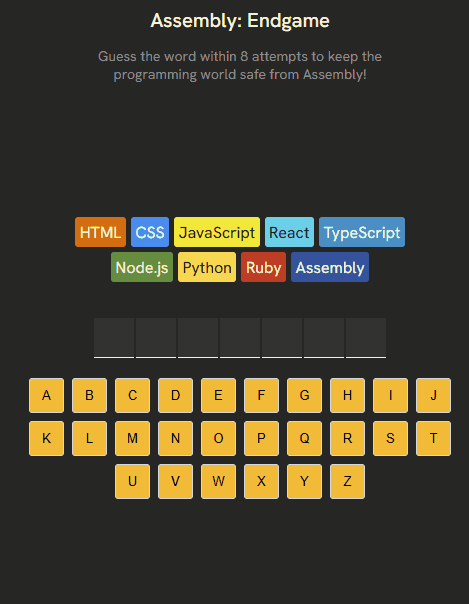

# 🎯 Assembly: Endgame

A simple React-based word guessing game where the player tries to uncover a hidden word by guessing one letter at a time. This project was built as a learning exercise to practice core React skills and improve accessibility, logic handling, and component structure. Capstone Project from The Frontend Developer Career Path on Scrimba.com

The game is deployed and hosted on Netlify. You can check out the live demo here: https://assemblyendgame-egeto.netlify.app/

## ⚙️ Features

- Randomly selects a new word each game.
- Tracks correct and incorrect letter guesses.
- Ends the game after 8 incorrect guesses or when the full word is guessed.
- Displays a "New Game" button after game ends.
- Celebrates a win with confetti animation using react-confetti.
- Use the `clsx` package to add conditional classNames.

## 🧠 Concepts and Skills Applied

### 🔧 React Fundamentals

- **State Management**: Used `useState` to manage guessed letters and current word.
- **Component Composition**: Modular design using different components like `Keyboard`, `Status`, `SecretWord`, and more.
- **Props and Event Handling**: Passed props for game logic and used event handlers to respond to user input.

### 🔄 Logic and Conditional Rendering

- Tracks correct vs. incorrect guesses.
- Renders visual feedback depending on game state (win, lose, in progress).
- Displays hidden or revealed letters dynamically.

### 🎉 Animation

- Integrated `react-confetti` to show a simple win celebration.

### ♿ Accessibility

- **ARIA Live Regions**: Added `aria-live="polite"` for screen reader updates on guesses and game progress.
- **Status Updates**: Communicates whether the latest guess was correct or incorrect.
- **Semantic HTML**: Used appropriate roles and screen only elements to improve screen reader compatibility.

## 🖼️ Screenshot

